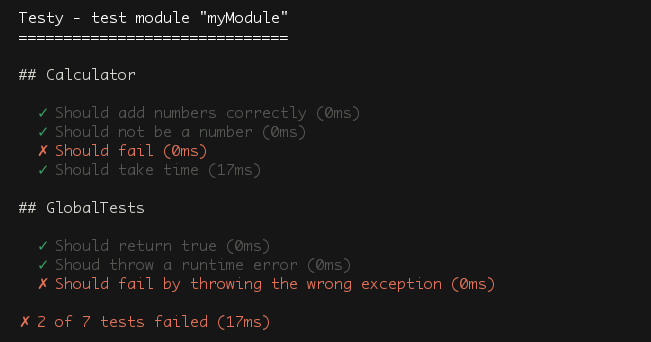

testy
=====

Testy is a micro C++ unit test tool.

Example
-------

Simple add your test by category, with a list of test functions and descriptions.

```c++

#include "testy.hpp"
#include "Calculator.hpp"

Suite("myModule", {

  describe("Calculator",

    it("Should equals to 4",
      return Calculator::getInstance().add(1, 2) == 3;
    ),

    it("Should not be a number",
      return Calculator::getInstance().isNumber("test") == false;
    ),

    it("Should fail",
      return false;
    ),

    it("Should take time",
      Calculator::getInstance().bigCalc();
      return true;
    )

  )

  describe("Useless tests",

    it("Should return true",
      return true;
    )

  )

})

```

The previous code will generate the following output:


